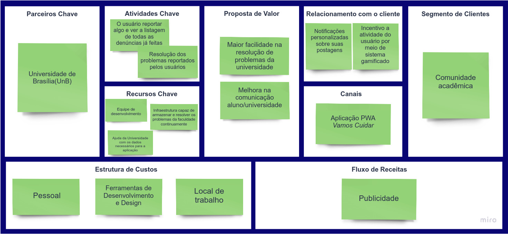

# Canvas

## Histórico de Revisão

Data|Versão|Descrição|Autor
-|-|-|-
02/10|0.1|Abertura do documento|Emily Dias|
02/10|0.2|Introdução|Emily Dias|
02/10|0.3|Modelo de negócios|Emily Dias, Enzo|

## Introdução

Utilizando os conceitos de design thinking, o canvas foi feito de uma formas simples que permite que todo negócio, ou seja, toda estratégia do produto consiga ser visualizada em uma só página, e com isto facilita em não ser necessário percorrer um documento cheio de páginas e textos para compreender as diferentes táticas definidas no projeto.

## Modelo de Negócios

## Bibliografia

* PEREIRA, Daniel. O que é o Business Model Canvas. Disponível em: <https://analistamodelosdenegocios.com.br/o-que-e-o-business-model-canvas/>. Acesso em 2 out 2020
