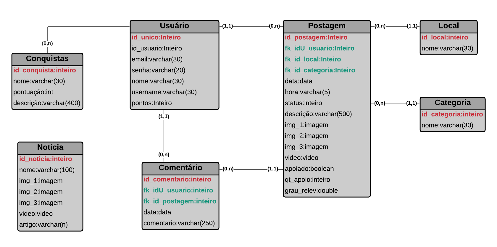
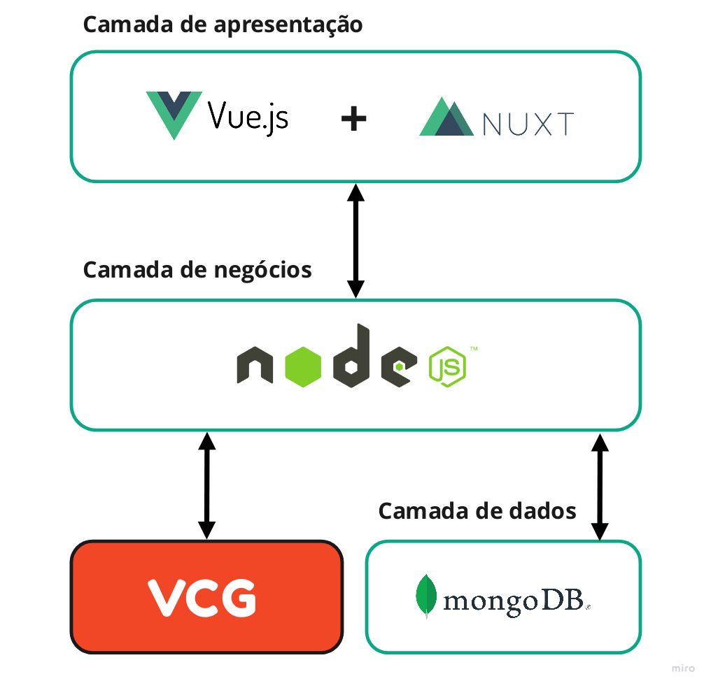
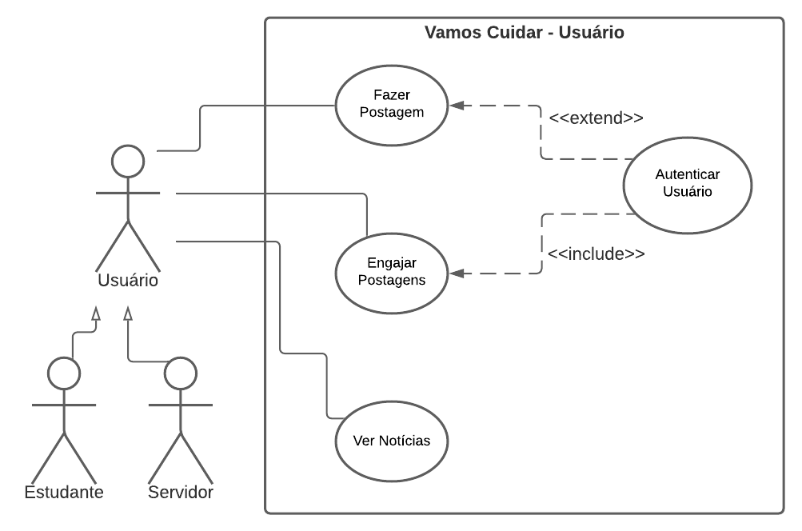

# Documento de Arquitetura de Software
## Histórico de Versões

Data|Versão|Descrição|Autor
-|-|-|-
28/08|1.0.0|Abertura do documento|Daniel Porto
31/08|1.0.1|Adição dos itens 4.1 e 4.3|Daniel Porto
15/09|1.0.2|Inserção dos requisitos nos casos de uso | Enzo Gabriel
15/09 | 1.0.3 | Adição das representações de arquitetura de back-end e front-end e das restrições | Enzo Gabriel
20/09 | 2.0.0 | Refatoração do documento: exclusão de tópico fora do padrão e correção de titulação, representação de arquitetura, metas e restrições e visão dos casos de uso | Daniel Porto e Enzo Gabriel

## 1. Introdução

### 1.1 Finalidade

 
 &emsp;&emsp; Este documento tem como finalidade fornecer uma visão geral da arquitetura da platoforma Vamos Cuidar UnB, utilizando-se de diversas visões arquiteturais - tais como a visão lógica e de caso de uso - a fim de facilitar o entendimento dos processos e funcionamento de todo o sistema. Tem também como objetivo transmitir as decisões arquiteturais significativas tomadas em relação ao mesmo.

### 1.2 Escopo

 &emsp;&emsp; Atráves desse documento, é possível obter um melhor entendimento da arquitetura do
 projeto, permitindo ao leitor a compreensão do funcionamento do sistem e as abordagens utilizadas para o
 seu desenvolvimento.

### 1.3 Definições, Acrônimos e Abreviações

Abreviação|Significado
|:-:|:-|
|**MDS**| Métodos de Desenvolvimento de Software|
|**UNB**| Universidade de Brasília|
|**PWA**| Progressive Web Application|
|**VCU**| Vamos Cuidar - Usuário|
|**VCG**| Vamos Cuidar - Gestão|
|**API**| Application Programming Interface|

### 1.4 Referências

Como documentar a arquitetura de software. Disponível em:  http://www.linhadecodigo.com.br/artigo/3343/como-documentar-a-arquitetura-de-software.aspx.

Documento de arquitetura ADA. Disponível em:  https://fga-eps-mds.github.io/2019.1-ADA/#/docs/project/architecture_doc.

Documento de arquitetura ArBC. Disponível em:  https://github.com/fga-eps-mds/2019.2-ArBC/blob/develop/docs/mds/Documento_de_arquitetura.md

Documento de arquitetura C-Registration System. Disponível em:  http://mds.cultura.gov.br/extend.formal_resources/guidances/examples/resources/sadoc_v1.htm.

Vue.js e suas vantagens.
Disponível em:  https://blog.geekhunter.com.br/vue-js-so-vejo-vantagens-e-voce/#O_que_e_Vue_JS

Características do node.
Disponível em:  https://king.host/wiki/artigo/o-que-e-o-node-js-e-quais-sao-as-suas-caracteristicas/

GridFS: como manipular arquivos e documentos grandes.
Disponível em:  http://db4beginners.com/blog/gridfs/#:~:text=Formalmente%20falando%2C%20o%20GridFS%20%C3%A9,parte%20como%20um%20documento%20separado.

### 1.5 Visão Geral

 &emsp;&emsp; Este documento é dividido em 7 tópicos, descrevendo os detalhes das características do software proposto.
Sendo dividido em:

* Introdução: Fornece uma visão geral do documento inteiro;
* Representação da arquitetura: Descreve qual é a arquitetura de software do sistema atual e como ela é representada;
* Metas e restrições da arquitetura: Descreve os requisitos e objetivos do software que têm algum impacto sobre a arquitetura;
* Visão de caso de uso: Descreve as partes significativas do ponto de vista da arquitetura do modelo de casos de uso;

## 2. Representação da Arquitetura

 &emsp;&emsp;A plataforma Vamos Cuidar é composta por duas frentes de desenvolvimento desacoplados: VCG e VCU.
A arquitetura utilizada no sistema desenvolvido pelo nosso grupo, VCU, é baseadada no modelo em 3 camadas, sendo composta pela camada de apresentação (front-end), pela camada de nogócios (back-end) e pela camada de dados.

### 2.1 Camada de apresentação (front-end)
#### 2.1.1 **VUE.js**

 &emsp;&emsp;O Vue.js é um framework Javascript ***open source*** que é utilizado para desenvolver vários tipos de interfaces que posuem necessidades de maior interação e experiência mais valorosa para o usuário. Lembrando que é  de fácil aprendizagem, o que facilita sua aplicação para uma equipe.

 &emsp;&emsp;Aplicações que usam Vue são constituídas de componentes com a sintaxe HTML, CSS e Javascript e um único arquivo .vue, o que facilita o isolamento e a manutenção de funcionalidades. Cada componente constituíndo um escopo isolado dos demais, tanto em lógica quanto nos estilos. Além disso, o Vue contem funcionalidades que facilitam no desenvolvimento de PWA, o que será de grande utilidade.

#### 2.1.2 **NUXT.js**

 &emsp;&emsp;Para auxiliar no desempenho da aplicação, foi escolhido o uso do NUXT.js que é um framework VUE.js que oferece algumas facilidades para o desenvolvimento de PWA em VUE.

### 2.2 Camada de negócios (Back-end)

 &emsp;&emsp;O framework escolhido para o back-end é o Node.Js, que pode ser definido como um ambiente de execução Javascipt server-side. Através dele, é possível desenvolver pequenas e grandes aplicações. É de código aberto e possui uma ampla comunidade.

Outros pontos fortes do Node são: 
- Ele utiliza JavaScript no back-end, então é possível usar JSON para tudo; 
- É possível rodar projetos abertos e com o sistema operacional que quiser; 
- Não necessidade de dependencias instaladas no seu computador para começar a usar; 
- Oferece muitos pacotes a partir do seu gerenciador de pacotes;
- Comunidade muito ativa.

 &emsp;&emsp;Visto, o já antes citado, desenvolvimento desacoplado da plataforma, o sistema desenvolvido por nós da frente VCU estará trocando dados com o sistema desenvolvido na frente VCG por essa camada utilizando APIs.

### 2.3 Camada de dados

 &emsp;&emsp;Essa camada é composta pelo banco de dados e a tecnologia escolhida para se trabalhar aqui foi o MongoDB. O MongoDB é um banco de dados to tipo NoSQL orientado a documentos do tipo Json, o que é muito interessante para a plataforma visto o uso do Javascript ao longo de todo o projeto.

#### 2.3.1 **Modelagem do banco de dados**

### 2.4 Diagrama de relações

## 3. Metas e Restrições de Arquitetura

### 3.1 Metas

&emsp;&emsp; O sistema da plataforma vamos cuidar deve ter acesso a uma câmera e aos arquivos de mídia para up-load de imagens que mostrarão os problemas diversos da universidade às autoridades competentes em resolve-los. O objetivo é melhorar a comunicação dos estudantes com a administração.

### 3.2 Restrições

#### 3.2.1 **Suportabilidade**

 &emsp;&emsp;Por ser uma aplicação com foco no PWA, ela deve poder ser acessada sem problemas nos principais navegadores na atualidade, tanto nas suas versões desktop quanto na mobile.

#### 3.2.2 **Usabilidade**

 &emsp;&emsp;É um sistema de fácil uso, onde o usuário não deve sofrer de dificuldades para a utilização da aplicação.

#### 3.2.3 **Ferramentas de Desenvolvimento**

 &emsp;&emsp;Tanto no back-end quanto no front-end serão utilizados frameworks Javascript. No banco de dados será utilizado o software MongoDB, que é um software escrito em C++. Também será utilizado o Docker, para facilitar a portabilidade do projeto e o pode ser usado o insomnia para testes das APIs.

#### 3.2.4 **Confiabilidade**

 &emsp;&emsp;Ao longo de cada etapa, serão feitos inúmeros testes, no intuito de proporcionar a melhor experiência para o usuário.

## 4. Visão dos Casos de Uso

### 4.1 Diagrama de Casos de Uso

### 4.2 Atores de Casos de Uso

|**Ator**|**Descrição**
|:-|:-|
|**Usuário**|O usuário poderá postar, de forma simples e acompanhada de texto, uma imagem que capture o problema relatado. Poderá também se engajar nas postagens para determinar o grau de relevância, acompanhar os status das publicações e ver notícias da universidade.

### 4.3 Descrições de Casos de Uso

|Épico | Caso de uso | Descrição |
|:-|:-|:-|
|E1|Autenticar usuário|Fazer login|
|E2|Fazer postagem|Criar postagem registrando algum problema.|
|E3|Engajar postagem|Interagir em uma postagem para definir a relevância da mesma.|
|E3|Ver notícias|Acompanhar as notícias da plataforma|