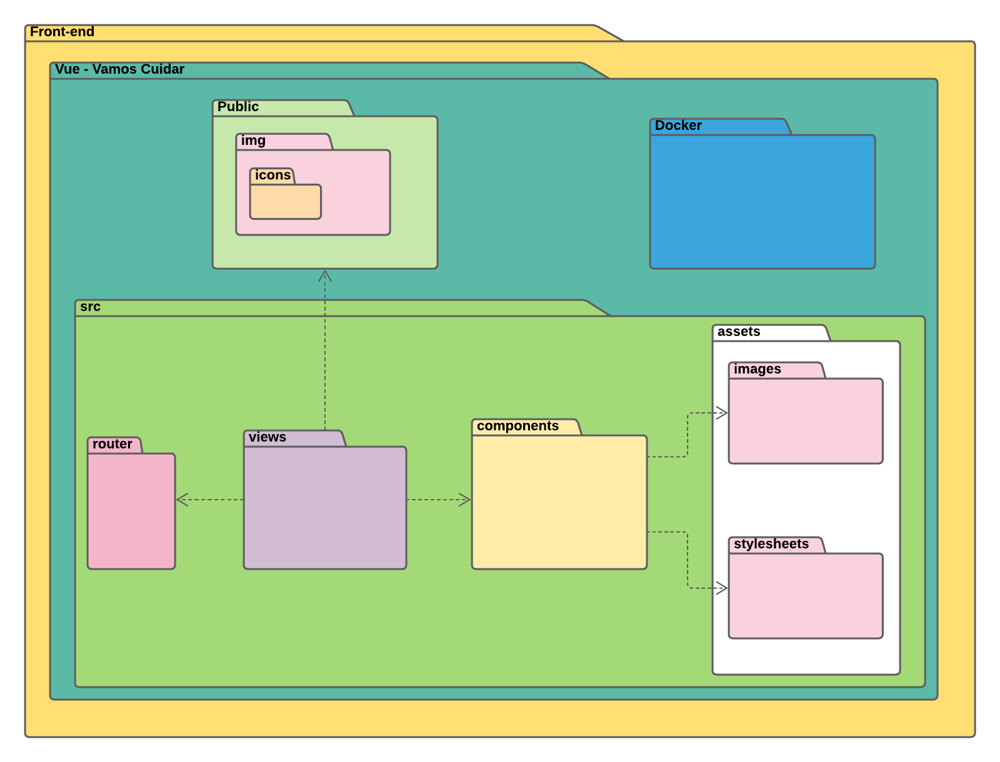
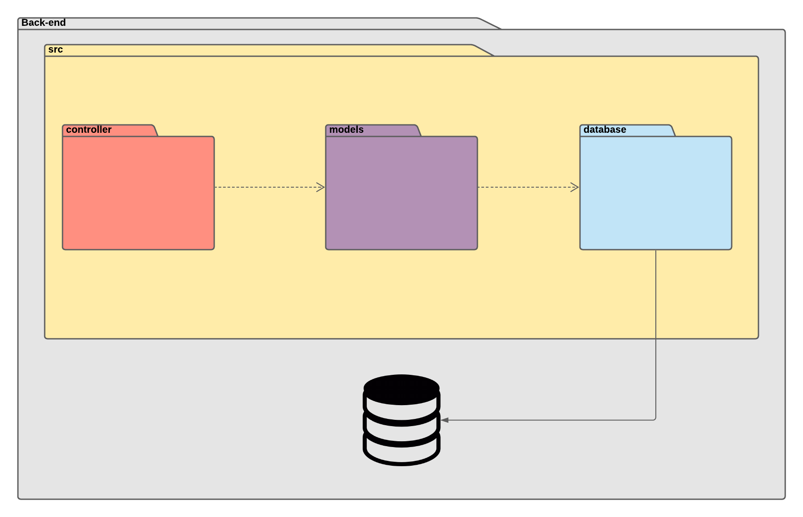

# Documento de Arquitetura de Software

## Histórico de Revisão

Data|Versão|Descrição|Autor
-|-|-|-
28/08|0.1|Abertura do documento|Daniel Porto
31/08|0.2|Adição dos itens 4.1 e 4.3|Daniel Porto
15/09|0.3|Inserção dos requisitos nos casos de uso | Enzo Gabriel
15/09| 0.4 | Adição das representações de arquitetura de back-end e front-end e das restrições | Enzo Gabriel
20/09| 1.0 | Refatoração do documento: exclusão de tópico fora do padrão e correção de titulação, representação de arquitetura, metas e restrições e visão dos casos de uso | Daniel Porto e Enzo Gabriel
22/09|1.1| Atualização do item 2 | Daniel Porto
22/09|1.2| Atualização do item 2.3.1 | Daniel Porto
24/09|1.3| Inserção dos diagramas de pacotes |Daniel Porto
06/10|1.4| Revisão do documento: padronizaçãos do versionamento, correção das referências e atualização dos tópicos 2.1.1, 2.2.1, 2.3.1 e 4.1. Inclusão do tópico 5 | Daniel Porto e Emily Dias
09/10|1.5| Inserindo uma descrição melhor sobre a frente VCG | Daniel Porto

## 1. Introdução

### 1.1 Finalidade

 
 &emsp;&emsp; Este documento tem como finalidade fornecer uma visão geral da arquitetura utilizada no desenvolvimento da frente VCU  da platoforma Vamos Cuidar, utilizando-se de diversas visões arquiteturais a fim de facilitar o entendimento dos processos e funcionamento de todo o sistema. Tem, também, como objetivo, transmitir as decisões arquiteturais significativas tomadas em relação ao mesmo.

### 1.2 Escopo

 &emsp;&emsp; Atráves desse documento, é possível obter um melhor entendimento da arquitetura do
 projeto, permitindo ao leitor a compreensão do funcionamento do sistem e as abordagens utilizadas para o
 seu desenvolvimento.

### 1.3 Definições, Acrônimos e Abreviações

Abreviação|Significado
-|-
**MDS**| Métodos de Desenvolvimento de Software
**UNB**| Universidade de Brasília
**PWA**| Progressive Web Application
**VCU**| Vamos Cuidar - Usuário
**VCG**| Vamos Cuidar - Gestão
**API**| Application Programming Interface
**MVC**| Model-View-Controller

### 1.4 Referências

* Como documentar a arquitetura de software. Disponível em:   http://www.linhadecodigo.com.br/artigo/3343/como-documentar-a-arquitetura-de-software.aspx

* Documento de arquitetura ADA. Disponível em:   https://fga-eps-mds.github.io/2019.1-ADA/#/docs/project/architecture_doc

* Documento de arquitetura ArBC. Disponível em:   https://github.com/fga-eps-mds/2019.2-ArBC/blob/develop/docs/mds/Documento_de_arquitetura.md

* Documento de arquitetura C-Registration System. Disponível em:   http://mds.cultura.gov.br/extend.formal_resources/guidances/examples/resources/sadoc_v1.htm

* Documentação do Vue.js. Disponível em:   https://v3.vuejs.org/guide/introduction.html 

* Introdução Express/Node. Disponível em:   https://developer.mozilla.org/pt-BR/docs/Learn/Server-side/Express_Nodejs/Introdu%C3%A7%C3%A3o

* Documentação MongoDb. Disponível em:   https://docs.mongodb.com/manual/introduction/  

### 1.5 Visão Geral

 &emsp;&emsp; Este documento é dividido em 5 tópicos, descrevendo os detalhes das características do software proposto. 
Sendo dividido em:

* Introdução: Fornece uma visão geral do documento inteiro;
* Representação da arquitetura: Descreve qual é a arquitetura de software do sistema atual e como ela é representada;
* Metas e restrições da arquitetura: Descreve os requisitos e objetivos do software que têm algum impacto sobre a arquitetura;
* Visão de caso de uso: Descreve as partes significativas do ponto de vista da arquitetura do modelo de casos de uso;
* Visão Lógica: Descreve as partes significativas do ponto de vista da arquitetura do modelo de design.

## 2. Representação da Arquitetura

 &emsp;&emsp;A plataforma Vamos Cuidar é composta por duas frentes de desenvolvimento desacoplados: VCG e VCU. 
&emsp;&emsp;A frente VCG é responsável pelo desenvolvimento da parte da plataforma que tem como usuários os administradores e gestores enquanto a frente VCU tem como usuários os estudantes e servidores da universidade. É importante ressaltar que o sistema VCU estará trocando informações com o VCG. Para maiores detalhes sobre o escopo da frente VCG, acesse o seu<a href="https://github.com/fga-eps-mds/2020.1-VC_Gestor-BackEnd"> Repositório</a>. 
&emsp;&emsp;A arquitetura utilizada no sistema desenvolvido pelo nosso grupo, VCU, utiliza o modelo MVC, sendo, portanto, composta por três camadas e o banco de dados. Para o desenvolvimento na nossa frente do projeto, separamos as camadas de forma que a camada de view seja representada e trabalhada no front-end e as camadas controller e model no back-end.

### 2.1 Font-end
&emsp;&emsp;Representando a camada de view no MVC, o front-end é onde se tem a interação do usuário. Para o front-end foi escolhido o Vue.js, que é um framework Javascript open source utilizado para desenvolver vários tipos de interfaces que posuem necessidades de maior interação e experiência mais valorosa para o usuário. Lembrando que é de fácil aprendizagem, o que facilita sua aplicação para uma equipe. 
&emsp;&emsp;Aplicações que usam Vue são constituídas de componentes com a sintaxe HTML, CSS e Javascript em um único arquivo .vue, o que facilita o isolamento e a manutenção de funcionalidades. Cada componente constitui um escopo isolado dos demais, tanto em lógica quanto nos estilos. Além disso, o Vue contem funcionalidades que facilitam no desenvolvimento de PWA, o que será de grande utilidade.

#### 2.1.1 **Diagrama de pacotes Front-end**

### 2.2 Back-end

 &emsp;&emsp;Englobando as camadas de  controller e model do mvc, no back-end é onde se encotram as regras de negócios e a comunicação com o banco de dados, o qual será tratado sobre no próximo tópico. 
 &emsp;&emsp;As tecnologias escolhidas para se trabalhar no back-end foram os frameworks Node.js e Express. 
&emsp;&emsp;O Node.Js pode ser definido como um ambiente de execução Javascipt server-side. Através dele, é possível desenvolver pequenas e grandes aplicações. É de código aberto e possui uma ampla comunidade.

Outros pontos fortes do Node são: 
- Ele utiliza JavaScript no back-end, então é possível usar JSON para tudo; 
- É possível rodar projetos abertos e com o sistema operacional que quiser; 
- Não necessidade de dependencias instaladas no seu computador para começar a usar; 
- Oferece muitos pacotes a partir do seu gerenciador de pacotes;
- Comunidade muito ativa.

 &emsp;&emsp;O Express é um framework Node.js que oferece, dentre muitas, uma série de funcionalidades para gerenciar requisições de diferentes verbos HTTP em diferentes URLs, integrar "view engines" para inserir dados nos templates, criar abstrações de rotas, middlewares para facilitar a criação de APIs.  
&emsp;&emsp;Visto, o já antes citado, desenvolvimento desacoplado da plataforma, o sistema desenvolvido por nós da frente VCU estará trocando dados com o sistema desenvolvido na frente VCG pela camada de controller utilizando APIs.

#### 2.2.1 **Diagrama de pacotes Back-end**

### 2.3 Banco de dados

 &emsp;&emsp;A tecnologia escolhida para se trabalhar aqui foi o MongoDB. O MongoDB é um banco de dados to tipo NoSQL orientado a documentos do tipo Json, o que é muito interessante para a plataforma visto o uso do Javascript ao longo de todo o projeto.

#### 2.3.1 **Modelagem do banco de dados**

## 3. Metas e Restrições de Arquitetura

### 3.1 Metas

&emsp;&emsp; O sistema da plataforma vamos cuidar deve ter acesso a uma câmera e aos arquivos de mídia para up-load de imagens que mostrarão os problemas diversos da universidade às autoridades competentes em resolve-los. O objetivo é melhorar a comunicação dos estudantes com a administração.

### 3.2 Restrições

#### 3.2.1 **Suportabilidade**

 &emsp;&emsp;Por ser uma aplicação com foco no PWA, ela deve poder ser acessada sem problemas nos principais navegadores na atualidade, tanto nas suas versões desktop quanto na mobile.

#### 3.2.2 **Usabilidade**

 &emsp;&emsp;É um sistema de fácil uso, onde o usuário não deve sofrer de dificuldades para a utilização da aplicação.

#### 3.2.3 **Ferramentas de Desenvolvimento**

 &emsp;&emsp;Tanto no back-end quanto no front-end serão utilizados frameworks Javascript. No banco de dados será utilizado o software MongoDB, que é um software escrito em C++. Também será utilizado o Docker, para facilitar a portabilidade do projeto e pode ser usado o insomnia para testes das APIs.

#### 3.2.4 **Confiabilidade**

 &emsp;&emsp;Ao longo de cada etapa, serão feitos inúmeros testes, no intuito de proporcionar a melhor experiência para o usuário.

## 4. Visão dos Casos de Uso

### 4.1 Diagrama de Casos de Uso

### 4.2 Atores de Casos de Uso

|**Ator**|**Descrição**
|:-|:-|
|**Usuário**|O usuário poderá postar, de forma simples e acompanhada de texto, uma imagem que capture o problema relatado. Poderá também se engajar nas postagens para determinar o grau de relevância, acompanhar os status das publicações e ver notícias da universidade.

### 4.3 Descrições de Casos de Uso

|Épico | Caso de uso | Descrição |
|:-|:-|:-|
|E1|Autenticar usuário|Fazer login|
|E2|Fazer postagem|Criar postagem registrando algum problema.|
|E3|Engajar postagem|Interagir em uma postagem para definir a relevância da mesma.|
|E3|Ver notícias|Acompanhar as notícias da plataforma|

## 5. Visão Lógica

 &emsp;&emsp;O contato do usuário com a plataforma será feito pela camada de view. Tanto em plataformas web mobile quanto em desktop, o Vue.js será o responsável em interpretar os eventos do front-end para a comunição com o back-end via API e, também, em organizar a trocas de dados e as disposições das informações na apresentação ao usuário. 
&emsp;&emsp;Por meio de requisições HTTP, o front-end estará trocando dados com o back-end que fará conexão ao banco de dados. Essa troca de dados será gerenciada pela camada de controller onde as diferentes rotas estarão definidas e as regras de nogócio implementadas. O controller lançará mão do apoio de logicas de middlewares para tratamento de dados e informaçõe e para autenticações de segurança. 
&emsp;&emsp;Além de se comunicar com o front-end, a camada controller se comunicará com os sistemas da frente VCG por requisições HTTP e terá uma mecânica semelhante a comunicação com o front-end.
Por fim, a camada model disponibilizará as estruturas de esquemas dos documentos que serão armazenados no baco de dados e estabelecerá o canal para modificar os registros.
