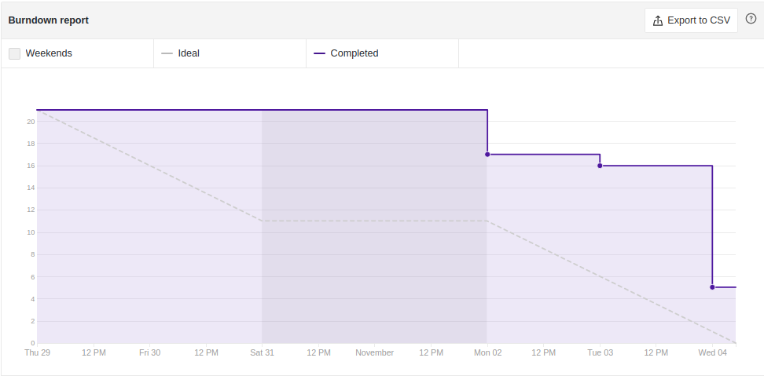
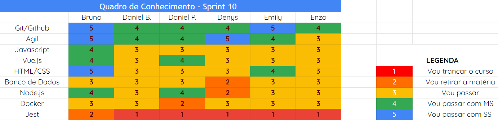
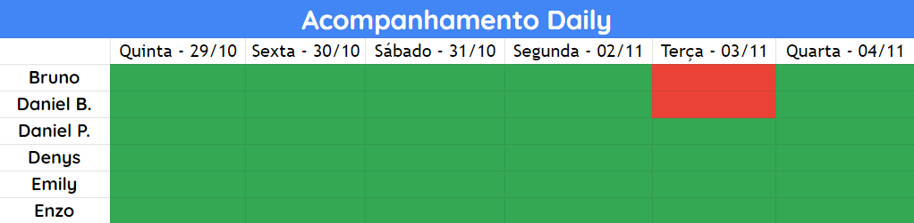

# Análise e Retrospectiva

## 1. Visão Geral
**Número da Sprint:** 10 
**Data de Início:** 29/10/2020 
**Data de Término:** 04/11/2020 
**Duração:** 7 dias 

## 2. Resultados
1. **Issue:** #161 US15 Filtrar postagens por categoria 
**Responsáveis:** Enzo e Emily 
**Pontuação:** 3 
**Status:** Não concluído 

2. **Issue:** #162 Desenvolver Testes - Back-end 
**Responsáveis:** Bruno, Daniel Barcelos, Daniel Porto, Denys, Emily e Enzo 
**Pontuação:** 5 
**Status:** Não concluído 

3. **Issue:** #163 Levantar pontuação das ações na aplicação 
**Responsáveis:** Bruno, Daniel Barcelos, Daniel Porto, Denys, Emily e Enzo 
**Pontuação:** 2 
**Status:** Concluído 

4. **Issue:** #164 Documentação da Sprint 9 
**Responsáveis:** Denys 
**Pontuação:** 1 
**Status:** Concluído 

5. **Issue:** #165 Estudar implementação de PWA 
**Responsáveis:** Denys e Enzo 
**Pontuação:** 3 
**Status:** Concluído 

6. **Issue:** #166 US11 US12 Editar e Excluir Postagem 
**Responsáveis:** Bruno e Daniel Barcelos 
**Pontuação:** 3 
**Status:** Não concluído 

7. **Issue:** #168 Inserir dependência de Teste - Front End 
**Responsáveis:** Bruno 
**Pontuação:** 1 
**Status:** Concluído 

8. **Issue:** #169 Resolver bug da listagem das postagens quando logado 
**Responsáveis:** Bruno 
**Pontuação:** 1 
**Status:** Concluído 

### 2.1 Pontuação 
- Pontos totais: 19
- Pontos concluídos:8

## 3. Burndown

## 4. Retrospective
### Pontos Positivos:
- Foi desenvolvido muitas funcionalidades;
- Não houve reuniões burocráticas.

### Pontos Negativos:
- Empacamento nas issues de testes.

### Pontos de Melhoria:
- Melhorar detalhamento nas issues;
- Apagar branch após fazer merge.

## 5. Quadro de Conhecimento

## 6. Presença  Daily 

## 7. Animal da Sprint
As abelhas são consideradas o símbolo do trabalho e da cooperação. Na sociedade das abelhas não há um posto central de comando. O poder é disseminado através da colmeia e as decisões diárias são tomadas consensualmente através de estímulos químicos, visuais, auditivos e táteis. Nesta sprint, conseguimos desenvolver muitas funcionalidades e a cooperação foi fundamental para isto.

## 8. Análise do Scrum Master
Nesta sprint não tivemos muitas distrações como reuniões ou algo parecido, e com isso conseguimos desenvolver muitos funcionalidades, faltando apenas pequenos detalhes para fazer os pull requests. Contudo, a issue de teste está atrasada há algum tempo e ficará como dívida técnica para ser resolvida na próxima sprint, onde devemos dar uma atenção especial para não espacar as próximas issues.

