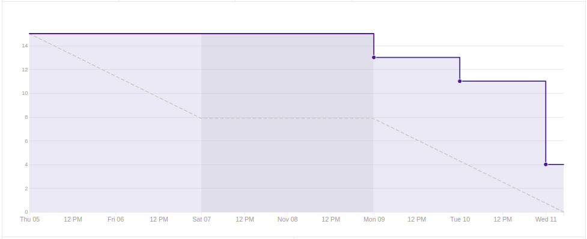
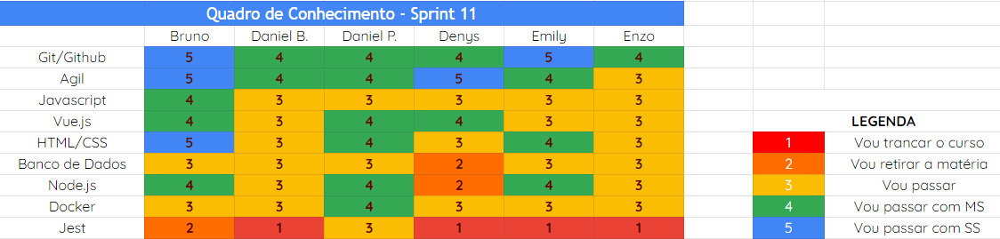

# Análise e Retrospectiva

## 1. Visão Geral
**Número da Sprint:** 11 
**Data de Início:** 05/11/2020 
**Data de Término:** 11/11/2020 
**Duração:** 7 dias 

## 2. Resultados
1. **Issue:** #174 Implementar Deploy 
**Responsáveis:** Bruno e Emily 
**Pontuação:** 2 
**Status:** Não concluído 

2. **Issue:** #175 Desenvolver Testes - Front-end 
**Responsáveis:** Bruno, Daniel Barcelos, Daniel Porto, Denys, Emily e Enzo 
**Pontuação:** 2 
**Status:** Não concluído 

3. **Issue:** #176 Padrões PWA 
**Responsáveis:** Denys e Enzo 
**Pontuação:** 3 
**Status:** Não cconcluído 

4. **Issue:** #177 Desenvolvimento e atualização de documentação 
**Responsáveis:** Denys e Daniel Porto 
**Pontuação:** 1 
**Status:** Concluído 

5. **Issue:** #178 Bug de duplicação do Code Climate em criar postagem 
**Responsáveis:** Bruno 
**Pontuação:** 1 
**Status:** Concluído 

6. **Issue:** #179 US10 Aplicar pontuação para o usuário 
**Responsáveis:** Daniel Barcelos e Emily 
**Pontuação:** 3 
**Status:** Não concluído 

7. **Issue:** #181 Bugs do Code Climate em support_postage 
**Responsáveis:** Bruno 
**Pontuação:** 2 
**Status:** Concluído 

8. **Issue:** #184 Refatorar Botão Apoiar 
**Responsáveis:** Bruno 
**Pontuação:** 1 
**Status:** Concluído 

### 2.1 Pontuação 
- Pontos totais: 15
- Pontos concluídos: 5

## 3. Burndown

## 4. Retrospective
### Pontos Positivos:
- Visão mais sólida do projeto.

### Pontos Negativos:
- Emperrados na issue de testes;
- Cansaço gerado pelo fim do semestre.

### Pontos de Melhoria:
- Olhar crítico voltado para finalização do projeto.

## 5. Quadro de Conhecimento

## 6. Presença  Daily 

## 7. Animal da Sprint
Os camelos, ou Camelus ferus, são animais originários da China e Mongólia. Tais indivíduos medem cerca de três metros, com cinquenta centímetros de cauda, e podem alcançar os 650 quilos. Um camelo consegue andar de 200 a 270 quilômetros pro dia, contudo, no momento que empacam, é difícil tira-los da zona de conforto.

## 8. Análise do Scrum Master
Neste sprint focamos em refatorar e corrigir alguns bugs, implementar o deploy e desenvoler a US10 e os testes. No entando, percebemos que pelo fato da issue de testes ter sido alocada para todos os membros, isso se tornou algo não produtivo e não conseguimos desenvolver esta issue. Estamos empacados nesta issue deste a sprint passada e tal impasse será resolvido na próxima sprint com a redução da alocação de membros e enfoque nos testes unitários. 
Conseguimos desenvolver a US10 e implementar os padrões de PWA que embora apresentem-se como "Não concluído", ambas estão na fase de Pull Request esperando a revisão.

