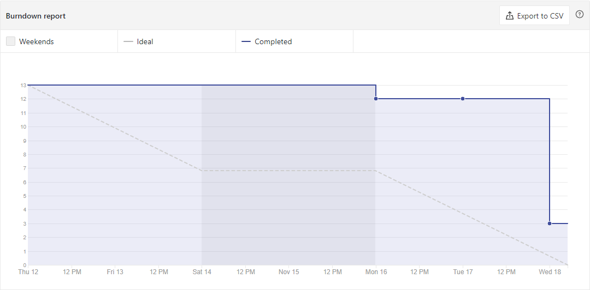
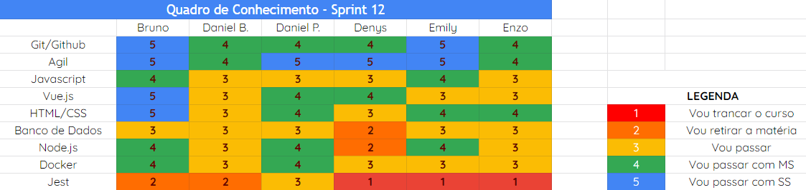
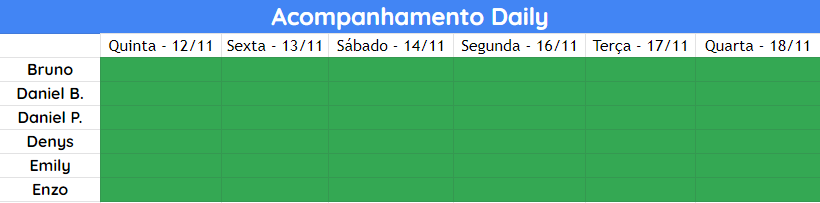

# Análise e Retrospectiva

## 1. Visão Geral
**Número da Sprint:** 12 
**Data de Início:** 12/11/2020 
**Data de Término:** 18/11/2020 
**Duração:** 7 dias 

## 2. Resultados
1. **Issue:** #187 Estilização do Projeto 2.0 
**Responsáveis:** Bruno e Enzo 
**Pontuação:** 3 
**Status:** Não concluído 

2. **Issue:** #188 Atualizar Épicos 
**Responsáveis:** Bruno 
**Pontuação:** 1 
**Status:** Concluído 

3. **Issue:** #189 Documentação da Sprint 11 
**Responsáveis:** Denys 
**Pontuação:** 1 
**Status:** Concluído 

4. **Issue:** #191 US09 Acessar área de noticías 
**Responsáveis:** Emily 
**Pontuação:** 5 
**Status:** Concluído 

5. **Issue:** #192 US22 Usuário comentar postagem 
**Responsáveis:** Bruno e Denys 
**Pontuação:** 3 
**Status:** Não concluído 

### 2.1 Pontuação 
- Pontos totais: 12
- Pontos concluídos: 7

## 3. Burndown

## 4. Retrospective
### Pontos Positivos:
- Estilização do projeto deixando mais profissional;
- Integração com o outro grupo (Dashboard).

### Pontos Negativos:
- Empacamento na issue de testes;
- Conflitos com outras disciplinas.

### Pontos de Melhoria:

## 5. Quadro de Conhecimento

## 6. Presença  Daily 

## 7. Animal da Sprint
O pavão é dono de uma plumagem exuberante, de cores intensas, multicoloridas e em tons de branco, azul, verde, dourado ou negro. Possuindo na época do acasalamento um bailado que evidencia, ainda mais, o brilho e a cor de sua plumagem.

## 8. Análise do Scrum Master
Nesta sprint progredimos em diversos quesitos, principalmente na estilização do projeto, deixando-o com uma aparecência mais profissional. Conseguimos integrar a área de notificações com a parte do Dashboard e desenvolvemos a US22 na qual o usuário poderá comentar uma postagem, contudo, ainda é observado que os testes que devem ser desenvolvidos têm apresentado uma certa dificuldade sendo um impasse para a equipe.

