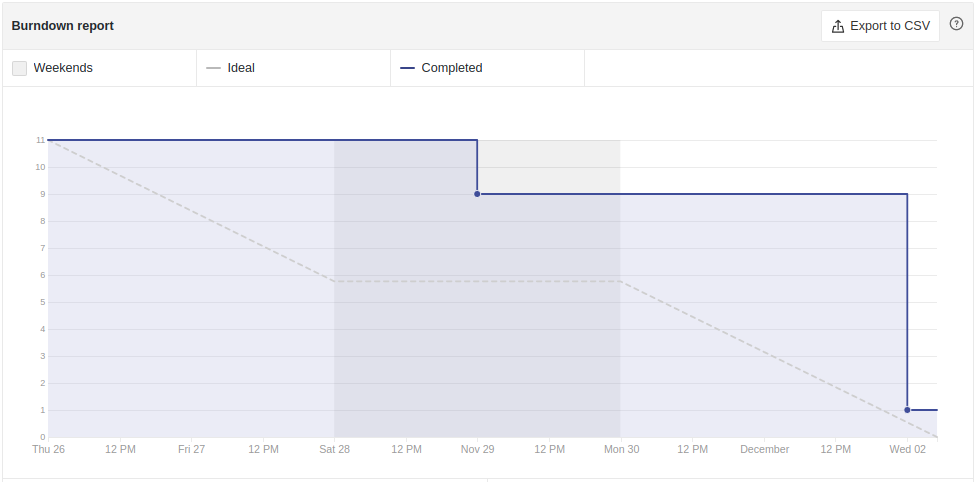
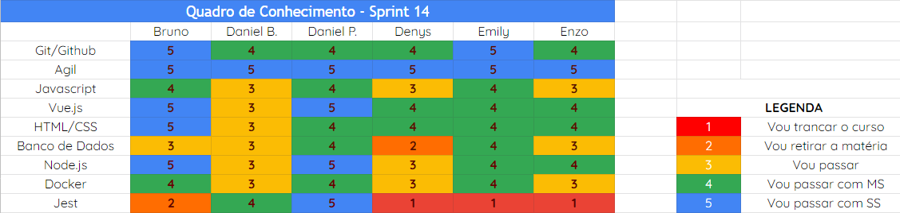
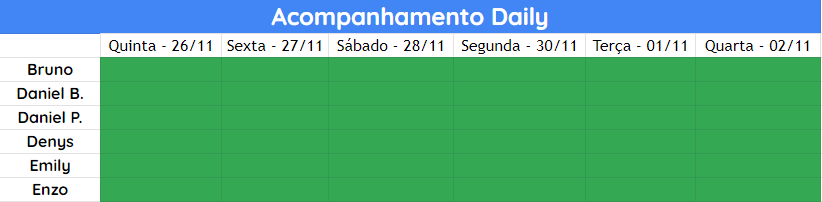

# Análise e Retrospectiva

## 1. Visão Geral
**Número da Sprint:** 14 
**Data de Início:** 26/11/2020 
**Data de Término:** 02/12/2020 
**Duração:** 7 dias 

## 2. Resultados

1. **Issue:** #196 Ajustes gerais 
**Responsáveis:** Daniel Porto e Daniel Barcelos 
**Pontuação:** 3 
**Status:** Não concluído 

2. **Issue:** #195 Bug de listagens 
**Responsáveis:** Bruno 
**Pontuação:** 2 
**Status:** Concluído 

3. **Issue:** #197 Arrumar Bugs na Aplicação 
**Responsáveis:** Bruno e Emily 
**Pontuação:** 3 
**Status:** Concluído 

4. **Issue:** #198 Documentação e atualização de documentos 
**Responsáveis:** Denys 
**Pontuação:** 1 
**Status:** Concluído 

5. **Issue:** #199 US20 Usuário logado denunciar postagem 
**Responsáveis:** Daniel Porto e Daniel Barcelos 
**Pontuação:** 3 
**Status:** Concluído 

6. **Issue:** #202 Arrumando bug do deploy 
**Responsáveis:** Emily 
**Pontuação:** 1 
**Status:** Não concluído 

### 2.1 Pontuação 
- Pontos totais: 13
- Pontos concluídos: 9

## 3. Burndown

## 4. Retrospective
### Pontos Positivos:
- Disciplina está no fim;
- Revisão de todo o projeto;
- Conseguimos utilizar o jest no back.

### Pontos Negativos:
- Empecilhos na integração com o Dashboard;
- Bug no deploy.

### Pontos de Melhoria:
- Não foi encontrado nenhum ponto onde possa haver melhorias.

## 5. Quadro de Conhecimento

## 6. Presença  Daily 

## 7. Animal da Sprint

Os cachorros são animais muito presentes em nossas vidas. Por terem altas doses de companheirismo, alegria e confiança, os cães são considerados os melhores amigos do homem e membros das famílias por onde passam. Mas a verdade é que os cachorros não cansam de nos surpreender todos os dias, e fazer com que aprendamos cada vez mais sobre suas particularidades.

## 8. Análise do Scrum Master
Após uma semana de descanso, a equipe voltou mais entusiasmada para finalizar a aplicação.Nesta sprint conseguimos desenvolver nossa última user story e com isso é possível denunciar uma postagem caso a mesma seja inadequada. Também corrigimos alguns bugs encontrados e finalmente conseguimos desenvolver alguns testes no back-end. Contudo, tivemos alguns empecilhos na integração com o grupo do Dashboard nessa etapa final.

Obs: Por questão de gerenciamento, a equipe decidiu realocar a issue #196 dos Ajustes gerais para a Sprint 15.

