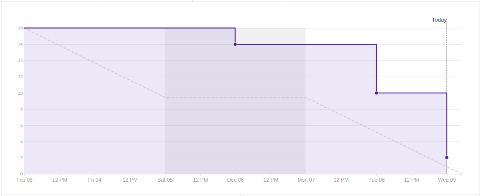
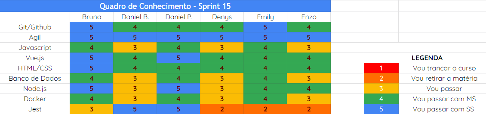

# Análise e Retrospectiva

## 1. Visão Geral
**Número da Sprint:** 15 
**Data de Início:** 03/11/2020 
**Data de Término:** 09/12/2020 
**Duração:** 7 dias 

## 2. Resultados

1. **Issue:** #196 Ajustes gerais 
**Responsáveis:** Daniel Porto e Daniel Barcelos 
**Pontuação:** 3 
**Status:** Concluído 

2. **Issue:** #202 Arrumando bug do deploy 
**Responsáveis:** Emily 
**Pontuação:** 1 
**Status:** Concluído 

3. **Issue:** #207 Revisão de documentação 
**Responsáveis:** Bruno, Daniel Porto e Denys 
**Pontuação:** 3 
**Status:** Concluído 

4. **Issue:** #208 Elaborar Apresentação R2 
**Responsáveis:** Bruno, Daniel Porto,Denys e Enzo 
**Pontuação:** 2 
**Status:** Concluído 

5. **Issue:** #209 Post Mortem 
**Responsáveis:** Bruno, Daniel Barcelos, Daniel Porto, Denys, Emily e Enzo 
**Pontuação:** 2 
**Status:** Concluído 

6. **Issue:** #210 Revisar Readme 
**Responsáveis:** Bruno e Daniel Barcelos 
**Pontuação:** 2 
**Status:** Concluído 

7. **Issue:** #211 Revisar todas as funcionalidades da aplicação 
**Responsáveis:** Enzo e Daniel Barcelos 
**Pontuação:** 3 
**Status:** Concluído 

8. **Issue:** #212 Documentação da Sprint 14 
**Responsáveis:** Denys 
**Pontuação:** 1 
**Status:** Concluído 

### 2.1 Pontuação 
- Pontos totais: 17
- Pontos concluídos: 17

## 3. Burndown

## 4. Retrospective
### Pontos Positivos:
- Última sprint e entrega da aplicação;
- Diminuição do ritmo e respiro para entrega.

### Pontos Negativos:
- Problemas na integração com o grupo Vamos Cuidar Gestor.

### Pontos de Melhoria:
- Não foi encontrado nenhum ponto onde possa haver melhorias.

## 5. Quadro de Conhecimento

## 6. Presença  Daily 

## 7. Animal da Sprint
A hiena vive em regiões da savana africana, sendo considerada um extraordinário predador. A fama de serem carniceiras não é merecida, pois são consideradas por alguns como caçadoras formidáveis, perseguindo suas presas a velocidades de até 64 km/h e caçando em grupos com até 100 indivíduos. São animais que são representados em filmes por sua "risada" característica e este é o nosso estado atual, sorrindo com o fim do projeto.

## 8. Análise do Scrum Master
Esta última sprint foi bem tranquila, deixamos para fazer os ajustes gerais, revisar alguns documentos e preparar a apresentação. 
É notavél a evolução de cada integrante do grupo ao longo do desenvolvimento, evolução esta que é refletida tanto nas hard skills quanto nas soft skills.
Acredito que o fato de não ter tido EPS, trouxe para a equipe bastante amadurecimento pois buscamos muito conhecimento para tormarmos as melhores decisões.
Entregamos nessa sprint nossa aplicação que é fruto de muito estudo e trabalho duro e isso trouxe bastente aprendizado para toda equipe.

