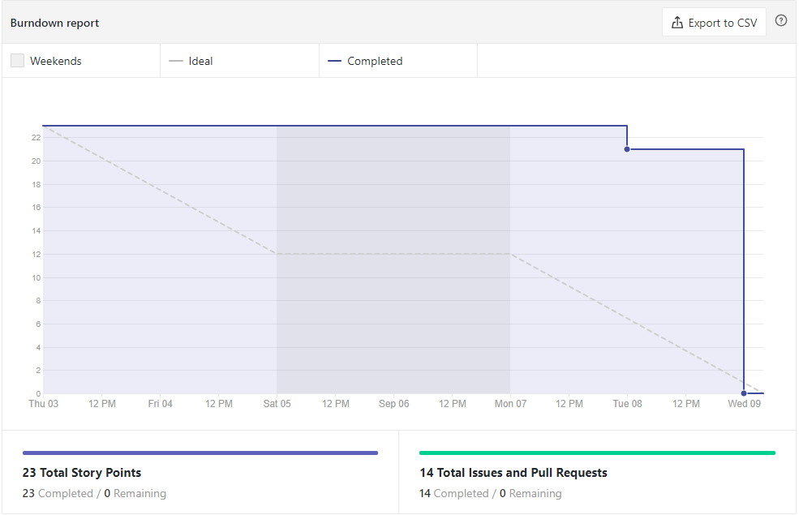
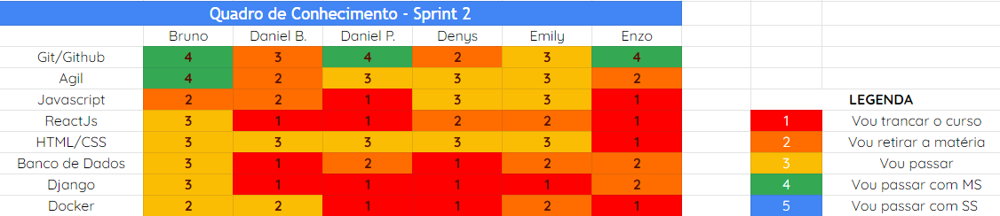
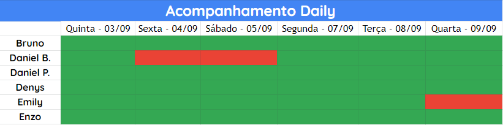

# Análise e Retrospectiva

## 1. Visão Geral
**Número da Sprint:** 2 
**Data de Início:** 03/09/2020 
**Data de Término:** 09/09/2020 
**Duração:** 7 dias 

## 2. Resultados

1. **Issue:** #38 Estudo, levantamento e debate sobre os requisitos do produto 
**Responsáveis:** Bruno, Daniel Barcelos, Daniel Porto, Denys, Emily e Enzo 
**Pontuação:** 2 
**Status:** Concluído 

2. **Issue:** #39 Estudo e levantamento de tecnologias/Front-end 
**Responsáveis:** Daniel Porto e Denys 
**Pontuação:** 2 
**Status:** Concluído 

3. **Issue:** #40 Estudo e levanatamento do ambiente/Docker 
**Responsáveis:** Daniel Barcelos e Emily 
**Pontuação:** 2 
**Status:** Concluído 

4. **Issue:** #41 Desenvolvimento do documento de visão - Tópico 1, 2 e 3 
**Responsáveis:** Bruno, Daniel Barcelos, Daniel Porto, Denys, Emily e Enzo 
**Pontuação:** 1 
**Status:** Concluído 

5. **Issue:** #42 Estudo e levantamento de tecnologias/Back-end 
**Responsáveis:** Bruno e Enzo 
**Pontuação:** 3 
**Status:** Concluído 

6. **Issue:** #43 Debate sobre tecnologias levantadas, Product Backlog pensado e Documento de Visão desenvolvido 
**Responsáveis:** Bruno, Daniel Barcelos, Daniel Porto, Denys, Emily e Enzo 
**Pontuação:** 2 
**Status:** Concluído 

7. **Issue:** #44 Estudo e levantamento de sistemas/Banco de dados 
**Responsáveis:** Bruno e Daniel Porto 
**Pontuação:** 3 
**Status:** Concluído 

8. **Issue:** #45 Estudo e inserção do template de Roadmap 
**Responsáveis:** Daniel Barcelos e Enzo 
**Pontuação:** 2
**Status:** Concluído 

9. **Issue:** #46 Pensamento e levantamento do Product Backlog 
**Responsáveis:** Bruno 
**Pontuação:** 3 
**Status:** Concluído 

10. **Issue:** #53 Reunião com clientes, grupo aliado e membros representantes da universidade 
**Responsáveis:** Bruno e Denys 
**Pontuação:** 3 
**Status:** Concluído 

### 2.1 Pontuação 
- Pontos totais: 23
- Pontos concluídos: 23

## 3. Burndown

## 4. Retrospective
### Pontos Positivos:
- Demos os primerios passos
- Trabalho em equipe
- Evolução na comunicação
- Melhora na colaboração
- Melhora no relacionamento com membros
- Reuniões focadas

### Pontos Negativos:
- Empacados no projeto
- Dependência de pessoas/fatores externos
- Falta de transparência (sincronia e transmissão de informações)
- Demora na criação das issues

### Pontos de Melhoria:
- Melhorar a dependência externa
- Melhorar comunicação com a professora

## 4. Quadro de Conhecimento

## 5. Presença  Daily 

## 7. Animal da Sprint
O pato é um dos poucos animais da natureza que anda, nada e voa com razoável competência, porém não consegue desempenhar nenhuma das atividades com maestria. Na Sprint 2 fizemos de tudo um pouco e demos nosso primeiros passos, porém, desengonçados.

## 8. Análise do Scrum Master
Nessa sprint demos nossos primeiros passos, escolhemos o tema e marcamos uma reunião com os clientes, o grupo aliado e os membros representantes da universidade, entretanto, esta reunião  foi cancelada pelos representantes da UnB e a alta expectativa que foi colocada nesta reunião impactou negativamente no desempenho da equipe. No entanto, ficou bem evidente a melhora na integração e a colaboração entre os membros da equipe. O time teve reuniões bem focadas e direcionadas e o único fator que atrapalhou foi a dependência externa que deve ser trabalhada nas próximas Sprints. 

