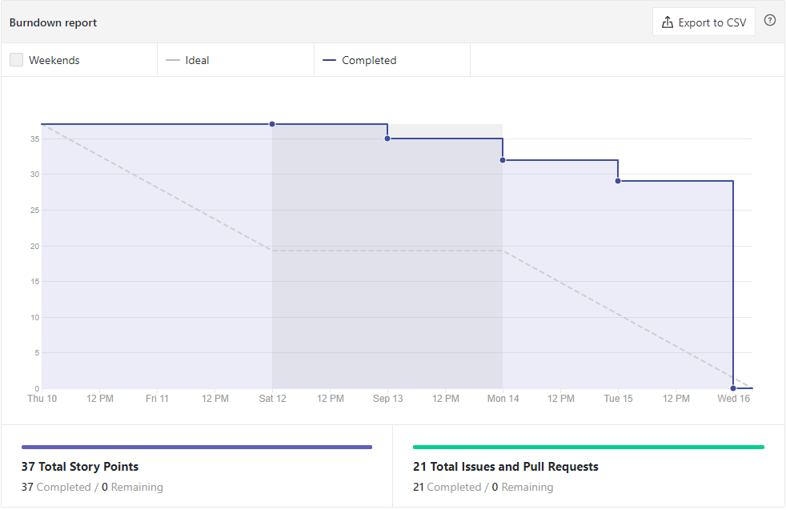
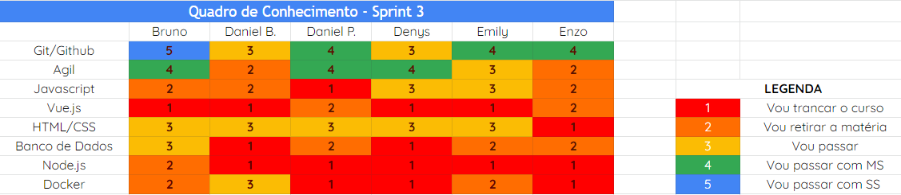
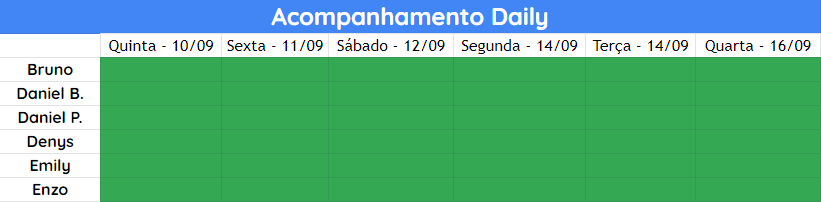

# Análise e Retrospectiva

## 1. Visão Geral
**Número da Sprint:** 3 
**Data de Início:** 10/09/2020 
**Data de Término:** 16/09/2020 
**Duração:** 7 dias 

## 2. Resultados
1. **Issue:** #55 Criar página para documentação - GitHub Page  
**Responsáveis:** Daniel Porto 
**Pontuação:** 2 
**Status:** Concluído 

2. **Issue:** #56 Estudo e Desenvolvimento do Planejamento de Riscos 
**Responsáveis:** Emily 
**Pontuação:** 3 
**Status:** Concluído 

3. **Issue:** #57 Documentação do planejamento e resultado das Sprints 
**Responsáveis:** Denys 
**Pontuação:** 3 
**Status:** Concluído 

4. **Issue:** #58 Desenvolvimento do Product Backlog 
**Responsáveis:** Bruno 
**Pontuação:** 2 
**Status:** Concluído 

5. **Issue:** #59 Finalizar Desenvolvimento do Documento de Visão 
**Responsáveis:** Bruno 
**Pontuação:** 2 
**Status:** Concluído 

6. **Issue:** #60 Desenvolvimento do README 
**Responsáveis:** Bruno 
**Pontuação:** 1 
**Status:** Concluído 

7. **Issue:** #62 Revisar Contributing e Políticas de Contribuição 
**Responsáveis:** Enzo 
**Pontuação:** 3 
**Status:** Concluído 

8. **Issue:** #64 Desenvolver o documento de arquitetura 
**Responsáveis:** Enzo 
**Pontuação:** 5 
**Status:** Não concluído 

9. **Issue:** #66 Desenvolver Identidade Visual 
**Responsáveis:** Denys e Daniel Porto 
**Pontuação:** 3 
**Status:** Não concluído 

10. **Issue:** #67 Desenvolver protótipo de baixa fidelidade 
**Responsáveis:** Daniel Porto e Denys 
**Pontuação:** 3 
**Status:** Não concluído 

11. **Issue:** #70 Reunião com grupo Dashboard 
**Responsáveis:** Bruno, Daniel Porto e Denys 
**Pontuação:** 2 
**Status:** Concluído 

12. **Issue:** #72 Criar ambiente de desenvolvimento 
**Responsáveis:** Daniel Barcelos 
**Pontuação:** 5 
**Status:** Não concluído 

13. **Issue:** #80 Definição da stack de tecnologias 
**Responsáveis:** Bruno, Daniel Barcelos, Daniel Porto, Denys, Emily e Enzo 
**Pontuação:** 3 
**Status:** Concluído 

### 2.1 Pontuação 
- Pontos totais: 35
- Pontos concluídos: 20

## 3. Burndown
 

## 4. Retrospective
### Pontos Positivos:
- Melhora na dependência
- Colaboração
- Estruturação do projeto
- Amadurecimento do escopo
- Comunicação com outras partes interessadas

### Pontos Negativos:
- Demora na criação das issues
- Mau uso do workflow do ZenHub
- Falta de pareamento nas issues difíceis, o que causou sobrecarga 

### Pontos de Melhoria:
- Melhorar Burndown 
- Melhorar planejamento da sprint
- Melhorar Roadmap

## 5. Quadro de Conhecimento
 

## 6. Presença Daily

## 7. Animal da Sprint
Jabutis são animais lentos, estritamente terrestres e bem solitário. Nesta Sprint, embora tenhamos ganhado mais independência, houve uma grande demora na criação das issues e pecamos em fazer pareamento. 

## 8. Análise do Scrum Master
Esta foi a primeira sprint na qual houve depedências técnicas e tal afirmação pode ser explicada pela falta de pareamento que deveria ter nas issues pontuadas com score máximo. As issues de prototipação e identidade visual não foram fechadas pois foi considerado que tais issues deveriam ter uma maior dedicação devido à importância pro projeto. Outro fator importante a pontuar é que foi feita uma reunião com o outro grupo responsável por desenvolver o Dashboard e após alguns pontos serem esclarecidos, a equipe se sentiu mais confiante e independente. Embora tenhamos melhorado a estruturação e o escopo do projeto, ainda é observado que há uma relativa demora na criação das issues e um mau uso do workflow do ZenHub.

