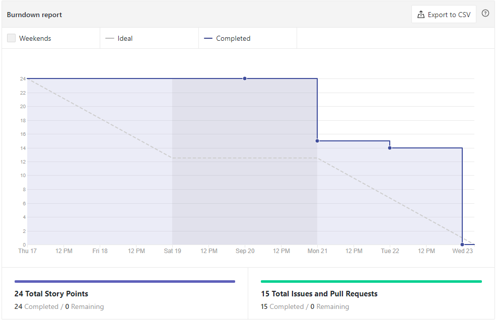
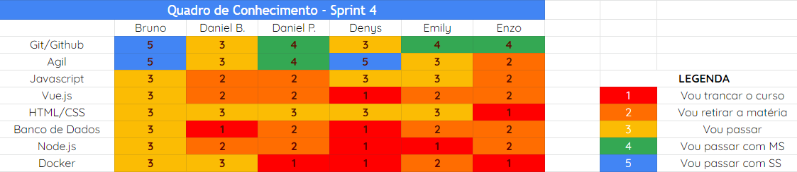
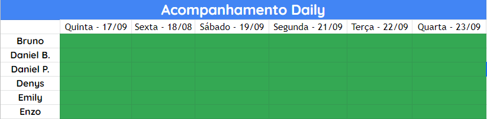

# Análise e Retrospectiva

## 1. Visão Geral
**Número da Sprint:** 4 
**Data de Início:** 17/09/2020 
**Data de Término:** 23/09/2020 
**Duração:** 7 dias 

## 2. Resultados
1. **Issue:** #84 Atualizar a GitHub Page  
**Responsáveis:** Daniel Porto e Denys 
**Pontuação:** 2 
**Status:** Concluído 

2. **Issue:** #85 Documentação do planejamento e resultado da Sprint 3 
**Responsáveis:** Denys 
**Pontuação:** 2 
**Status:** Concluído 

3. **Issue:** #86 Revisar Roadmap 
**Responsáveis:** Daniel Barcelos e Enzo 
**Pontuação:** 3 
**Status:** Concluído 

4. **Issue:** #87 Reunião com o grupo do dashboard, DAF e Hackathon 
**Responsáveis:** Bruno e Daniel Porto 
**Pontuação:**  
**Status:** Concluído 

5. **Issue:** #88 Considerações dos documentos gerados - Políticas 
**Responsáveis:** Bruno 
**Pontuação:** 1 
**Status:** Concluído 

6. **Issue:** #90 Revisar Product Backlog e requisitos 
**Responsáveis:** Bruno 
**Pontuação:** 2 
**Status:** Concluído 

7. **Issue:** #92 Considerações dos documentos gerados - Documentos do projeto 
**Responsáveis:** Bruno 
**Pontuação:**  
**Status:** Concluído 

8. **Issue:** #93 Desenvolver protótipo de alta fidelidade 
**Responsáveis:** Bruno e Emily 
**Pontuação:** 2 
**Status:** Concluído 

### 2.1 Dívidas técnicas alocadas

9. **Issue:** #64 Desenvolver o documento de arquitetura 
**Responsáveis:** Enzo 
**Pontuação:** 5 
**Status:** Concluído 

10. **Issue:** #66 Desenvolver Identidade Visual 
**Responsáveis:** Denys e Daniel Porto 
**Pontuação:** 3 
**Status:** Concluído 

11. **Issue:** #67 Desenvolver protótipo de baixa fidelidade 
**Responsáveis:** Daniel Porto e Denys 
**Pontuação:** 3 
**Status:** Concluído 

12. **Issue:** #72 Criar ambiente de desenvolvimento 
**Responsáveis:** Daniel Barcelos 
**Pontuação:** 5 
**Status:** Concluído 

### 2.2 Pontuação 
- Pontos totais: 12+15=27
- Pontos concluídos: 27

## 3. Burndown

## 4. Retrospective
### Pontos Positivos:
- Reunião com todas as partes interessadas
- Feedback da Letícia e do João
- Amadurecimento na documentação e no projeto em si
- Burndown

### Pontos Negativos:
- Planejar melhor as depedência da criação das issues
- Má distribuição das issues
- Respeitar a backlog da sprint

### Pontos de Melhoria:
- Melhorar tempo de aceitação do pull request
- Melhorar pareamento

## 5. Quadro de Conhecimento

## 6. Presença  Daily 

## 7. Animal da Sprint
 Os cangurus são animais grandes e fortes, podendo ultrapassar os dois metros de altura quando ficam eretos e podendo ultrapassar também os 80 kg. Nesta Sprint demos grandes saltos rumo ao desenvolvimento do projeto.

## 8. Análise do Scrum Master
Esta Sprint foi muito produtiva, após nos reunirmos com o pessoal do DAF e com os ganhadores do Hackathon (reunião esta que estavámos tentando ter há semanas), tivemos que refazer o product backlog mas isso trouxe um amadurecimento maior das features e do projeto em si. Conseguimos acabar com todas as dívidas técnicas e todas as issues planejadas foram concluídas. A equipe finalizou toda a identidade visual e a prototipação. Tais atividades tiveram participação de todos os membros da equipe, o que ajudou muito na visão de produto a ser desenvolvido e na discussão de ideias.
