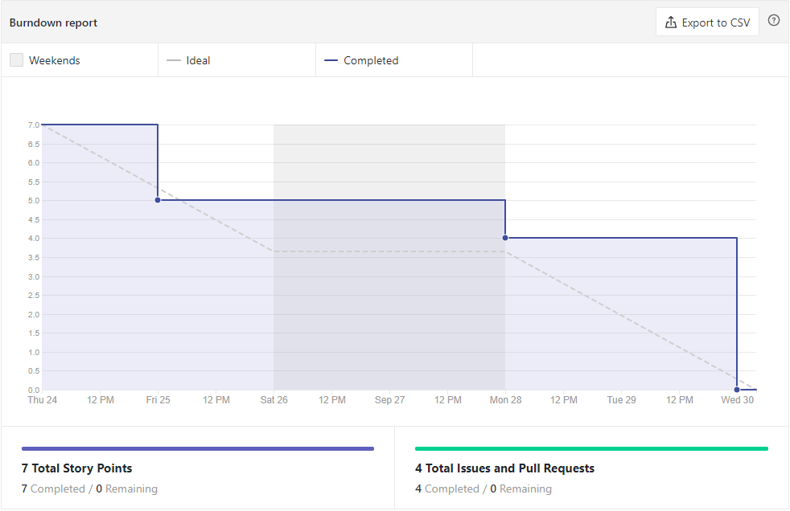
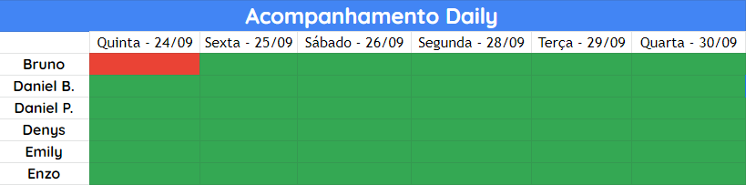

# Análise e Retrospectiva

## 1. Visão Geral
**Número da Sprint:** 5 
**Data de Início:** 24/09/2020 
**Data de Término:** 30/09/2020 
**Duração:** 7 dias 

## 2. Resultados

1. **Issue:** #104 US01 - Postagem Anonima 
**Responsáveis:** Bruno, Daniel Barcelos, Daniel Porto, Denys, Emily e Enzo 
**Pontuação:** 2 
**Status:** Concluído 

2. **Issue:** #106 Criar perfil de comunidade Open Source - FrontEnd 
**Responsáveis:** Bruno 
**Pontuação:**  
**Status:** Concluído 

### 2.1 Pontuação 
- Pontos totais: 2
- Pontos concluídos: 2

## 3. Burndown

## 4. Retrospective
### Pontos Positivos:
- Começamos a codar;
- Iniciamos pareamento no programação;
- Consciência maior de como será o projeto;
- Transparência na comunicação.

### Pontos Negativos:
- Concentração de tarefas em poucas pessoas;
- Sobrecarga de alguns membros;
- Mau planejamento da user story.

### Pontos de Melhoria:
- Proatividade;
- Melhorar qualidade do pareamento;
- Melhorar comunicação da equipe;
- Compartilhar fontes de conhecimento;
- Melhorar revisão dos Pull Requests;
- Acrescentar mais issues.

## 5. Quadro de Conhecimento

## 6. Presença  Daily 

## 7. Animal da Sprint
Ursos são animais conhecidos por fazerem uma bagunça onde chegam. Na economia, o urso é adotado para representar a queda no mercado de ações (bearish). Nesta sprint, houve uma pequena bagunça no planejamento da user story e houve uma queda no grande salto ao desenvolvimento que estávamos tendo.

## 8. Análise do Scrum Master
A Sprit foi um pouco controversa, foram criado apenas duas issues, mas toda a equipe foi alocada, contudo, a dependência que algumas tarefas tinham das outras, comprometeu o andamento do projeto no período da Sprint. Embora todas issues tenham sido fechadas, tal fato foi discutido na Retrospective e a equipe reconheceu a falta de comunicação que estava acontecendo. Foi um momento de catarse geral e acredito que este acontecimento tenha contribuído na união da equipe. 
