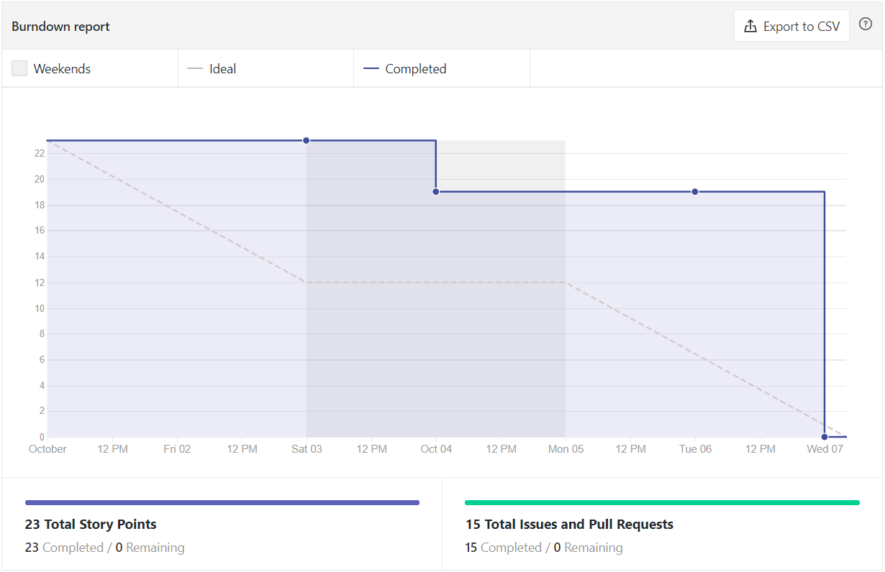
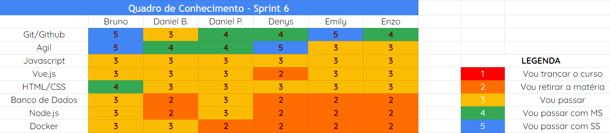
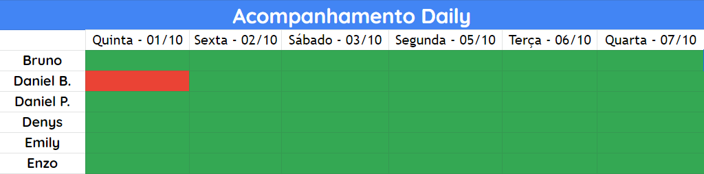

# Análise e Retrospectiva

## 1. Visão Geral
**Número da Sprint:** 6 
**Data de Início:** 01/10/2020 
**Data de Término:** 07/10/2020 
**Duração:** 7 dias 

## 2. Resultados
1. **Issue:** #110 Criar documento Canvas 
**Responsáveis:** Emily e Enzo 
**Pontuação:** 2 
**Status:** Concluído 

2. **Issue:** #111 Revisão de documentação 
**Responsáveis:** Bruno, Daniel Barcelos, Daniel Porto, Denys, Emily e Enzo 
**Pontuação:** 3 
**Status:** Concluído 

3. **Issue:** #112 US02 - Tela inicial/Feed de postagens 
**Responsáveis:** Daniel Porto, Denys 
**Pontuação:** 3 
**Status:** Concluído 

4. **Issue:** #113 US04 - Status de resolução dos problemas 
**Responsáveis:** Daniel Barcelos, Daniel Porto, Denys e Emily 
**Pontuação:** 5 
**Status:** Concluído 

5. **Issue:** #114 Produção da apresentação para a R1 
**Responsáveis:** Denys e Bruno 
**Pontuação:** 3 
**Status:** Concluído 

6. **Issue:** #115 US06 - Fazer cadastro e login 
**Responsáveis:** Bruno e Enzo 
**Pontuação:** 2 
**Status:** Concluído 

6. **Issue:** #116 Visualizar detalhes de postagem 
**Responsáveis:** Emily e Daniel Barcelos 
**Pontuação:** 3 
**Status:** Concluído 

### 2.1 Pontuação 
- Pontos totais: 21
- Pontos concluídos: 21

## 3. Burndown

## 4. Retrospective
### Pontos Positivos:
- Qualidade nos pareamentos
- Proatividade
- Melhora na comunicação e transparência
- Melhora no compartilhamento de fontes de conhecimento

### Pontos Negativos:
- Overengineering 

### Pontos de Melhoria:
- Organização na execução do vídeo para release
- Melhorar velocidade de revisão dos Pull Requests
- Burndown

## 5. Quadro de Conhecimento

## 6. Presença  Daily 

## 7. Animal da Sprint
Na economista o símbolo do Touro indica tendência de alta na bolsa (bullish). O termo vem do fato de que quando um touro ataca, ele utiliza seus chifres em um movimento de baixo para cima. Nesta Sprint, revertemos o pequeno movimento de baixa que tivemos na sprint passada e já subimos, novamente, para uma tendência de alta.

## 8. Análise do Scrum Master
Nesta Sprint tivemos um ótimo desempenho nos parementos e na execução do projeto. Acredito que após alguns desabafos que aconteceram na Sprint passada, a equipe obteve uma grande melhora na transparência e senso de equipe e isso refletiu diretamente na performace durante a Sprint. Outro ponto a destacar é que o desenvolvimento na Sprint contribuiu significativamente ao aperfeiçoamento do conhecimento técnico dos integrantes.