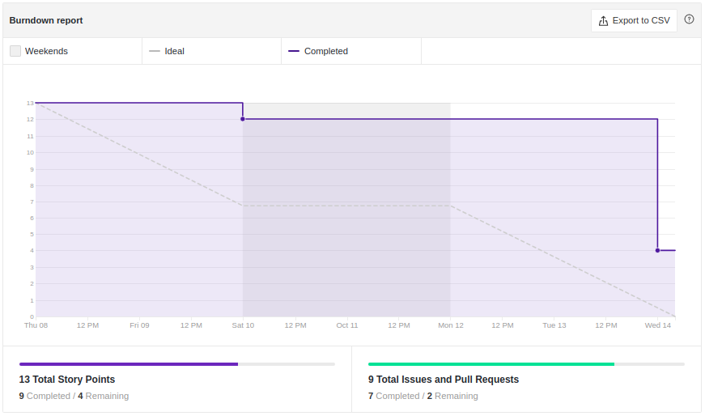
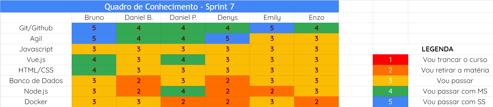
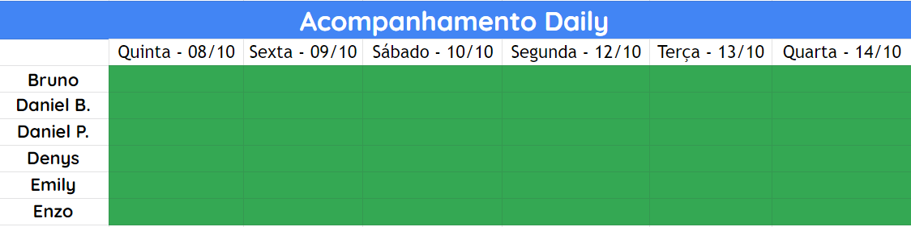

# Análise e Retrospectiva

## 1. Visão Geral
**Número da Sprint:** 7 
**Data de Início:** 08/10/2020 
**Data de Término:** 14/10/2020 
**Duração:** 7 dias 

## 2. Resultados
1. **Issue:** #126 US05 - Fazer Cadastro (BackEnd) 
**Responsáveis:** Daniel Porto e Enzo 
**Pontuação:** 2 
**Status:** Concluído 

2. **Issue:** #128 Estilização do Projeto 
**Responsáveis:** Daniel Barcelos e Denys 
**Pontuação:** 2 
**Status:** Concluído 

3. **Issue:** #129 Feedback Release 1 - Documentação 
**Responsáveis:** Daniel Porto e Emily 
**Pontuação:** 1 
**Status:** Concluído 

4. **Issue:** #130 US06 Fazer e desfazer login na plataforma 
**Responsáveis:** Daniel Porto e Enzo 
**Pontuação:** 2 
**Status:** Não concluído 

5. **Issue:** #131 Estudo sobre segurança 
**Responsáveis:** Bruno, Daniel Barcelos, Daniel Porto, Denys, Emily e Enzo 
**Pontuação:** 2 
**Status:** Concluído 

### 2.1 Pontuação 
- Pontos totais: 9
- Pontos concluídos: 7 

## 3. Burndown

## 4. Retrospective
### Pontos Positivos:
- Tomada de decisão
- Trabalho constante

### Pontos Negativos:
- Qualidade dos pareamentos 
- Falta de replanejamento durante a sprint/Adaptação falha durante sprint

### Pontos de Melhoria:
- Melhorar entregas durante a sprint
- Melhorar roadmap
- Melhorar replanejamento quando houver 

## 5. Quadro de Conhecimento

## 6. Presença  Daily 

## 7. Animal da Sprint
Os coalas apresentam hábito noturno a crepuscular. Passam grande parte da sua vida nas árvores. Nessa Sprint, trabalhamos sobertudo, no ambiente noturno.

## 8. Análise do Scrum Master
Embora esta Sprint seja usuada para descanso por muitos grupos, decidimos fazer poucas issues (importantes) mas ainda manter a produtividade. Conseguimos entregar grande parte do que foi planejado, mas falhamos na verificação da correlação de depedência entre as issues e por conta disso, uma dupla acabou atropelando a outra. Embora tenha sido algo bom pro andamento do projeto, uma vez que esta parte foi concluída, foi algo maléfico para a circulação de conhecimento entre a equipe. Após aferirmos este aspecto negativo, a equipe se comprometeu a não comete-lo novamente.