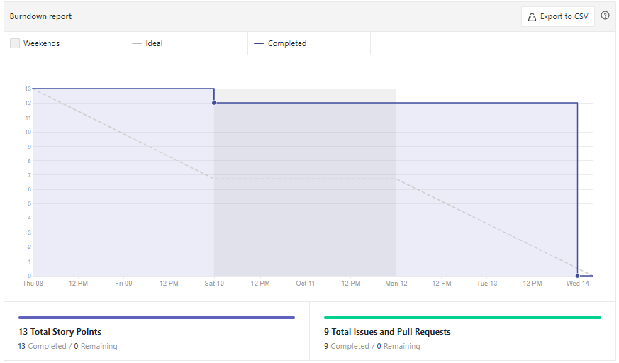
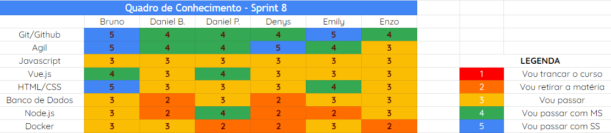
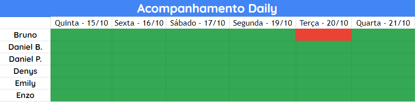

# Análise e Retrospectiva

## 1. Visão Geral
**Número da Sprint:** 8 
**Data de Início:** 15/10/2020 
**Data de Término:** 21/10/2020 
**Duração:** 7 dias 

## 2. Resultados
1. **Issue:** #135 Atualizar Roadmap da Sprint 7 
**Responsáveis:** Emily 
**Pontuação:** 1 
**Status:** Concluído 

2. **Issue:** #136 US07 Usuário logado realizar uma postagem não anônima 
**Responsáveis:** Daniel Barcelos e Enzo 
**Pontuação:** 3 
**Status:** Não concluído 

3. **Issue:** #137 US08 Usuário apoiar postagem 
**Responsáveis:** Bruno e Daniel Barcelos 
**Pontuação:** 3 
**Status:** Não concluído 

4. **Issue:** #139 US09 Feed de Notícias 
**Responsáveis:** Bruno e Daniel Porto 
**Pontuação:** 5 
**Status:** Concluído 

5. **Issue:** #140 Reunião Release 1 com DAF e Dashboard 
**Responsáveis:** Bruno 
**Pontuação:** 2 
**Status:** Concluído 

6. **Issue:** #141 Code climate e integrar ao repositório 
**Responsáveis:** Enzo e Emily 
**Pontuação:** 3 
**Status:** Concluído 

7. **Issue:** #143 Reunião de Sincronização com grupo Dashboard 
**Responsáveis:** Bruno 
**Pontuação:** 2 
**Status:** Concluído 

8. **Issue:** #144 US11, 12, 13 e 14 - Tela de Perfil de Usuário 
**Responsáveis:** Denys e Emily 
**Pontuação:** 3 
**Status:** Concluído 

9. **Issue:** #146 Documentação Sprint 7 
**Responsáveis:** Denys 
**Pontuação:** 1 
**Status:** Concluído 

### 2.1 Pontuação 
- Pontos totais: 23
- Pontos concluídos: 17 

## 3. Burndown

## 4. Retrospective
### Pontos Positivos:
- Bom planejamento
- Velocidade para fechar issues
- Reunião com DAF e o VCG

### Pontos Negativos:
- Acúmulo de outras disciplinas 
- Problemas de saúde de alguns membros
- Dívidas técnicas de issues importantes

### Pontos de Melhoria:
- Gestão do tempo levando em consideração outras disciplinas
- Tempo para iniciar issues difíceis 

## 5. Quadro de Conhecimento

## 6. Presença  Daily 

## 7. Animal da Sprint
É inégavel que os cachorros adoram ser o centro das atenções e sempre tentam estar com seus donos, é por isto que o cachorro é considerado o melhor amigo do homem. Nesta Sprint, fizemos algumas reuniões que foram importantes para o desenvolvimento do software.

## 8. Análise do Scrum Master
Nesta Sprint foi feita duas reuniões: uma com o grupo "Vamos Cuidar Gestor" para alinhamento e discussão do projeto e outra com o DAF e o STI para discutir questões mais burocráticas. Vale salientar que embora tais reuniões tenham sido importantes para a visão de projeto e esclarecimentos de questões técnicas, a reunião com o DAF e STI não foi finalizada, e por se tratar de aspectos burocráticos, acredito que não tenha sido tão proveitosa para equipe. Nesta semana, alguns fatores atrapalharam o andamento do projeto e isto refletil no número de issues fechadas. Dentre tais fatores destaco: matéria acumulada e questões de saúde.

