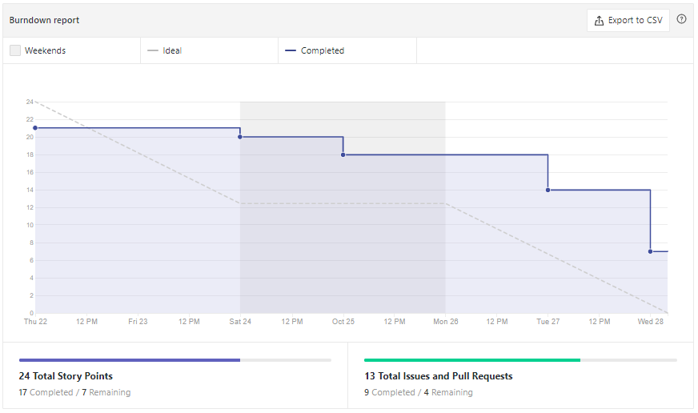
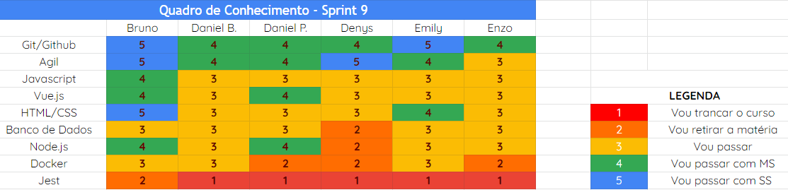
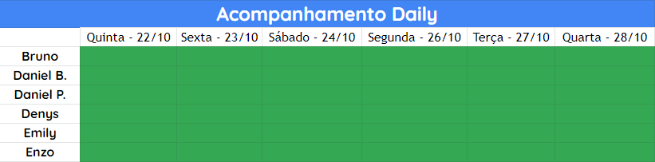

# Análise e Retrospectiva

## 1. Visão Geral
**Número da Sprint:** 9 
**Data de Início:** 22/10/2020 
**Data de Término:** 28/10/2020 
**Duração:** 7 dias 

## 2. Resultados
1. **Issue:** #148 Padronizar importação style de cores 
**Responsáveis:** Emily 
**Pontuação:** 1 
**Status:** Concluído 

2. **Issue:** #149 Documentacao da Sprint 8 
**Responsáveis:** Denys 
**Pontuação:** 1 
**Status:** Concluído 

3. **Issue:** #150 Implementar testes 
**Responsáveis:** Bruno e Denys 
**Pontuação:** 5 
**Status:** Não concluído 

4. **Issue:** #151 Correão da funcionalidade da seta de voltar página 
**Responsáveis:** Enzo 
**Pontuação:** 2 
**Status:** Concluído 

5. **Issue:** #152 Reunião com STI, DAF e Dashboard 
**Responsáveis:** Bruno 
**Pontuação:** 3 
**Status:** Concluído 

6. **Issue:** #153 Resolução de bug relacionado a release 1 
**Responsáveis:** Daniel Barcelos e Denys 
**Pontuação:** 3 
**Status:** Não concluído 

7. **Issue:** #154 US14 Excluir conta de usuário 
**Responsáveis:** Emily e Daniel Porto 
**Pontuação:** 2 
**Status:** Não concluído 

8. **Issue:** #155 US13 Editar conta do usuário 
**Responsáveis:** Emily e Daniel Porto 
**Pontuação:** 2 
**Status:** Não concluído 

9. **Issue:** #156 Atualizar documentos 
**Responsáveis:** Daniel Porto 
**Pontuação:** 2 
**Status:** Concluído 

### 2.1 Pontuação 
- Pontos totais: 21
- Pontos concluídos: 9 

## 3. Burndown

## 4. Retrospective
### Pontos Positivos:
- Recuperação da saúde dos membros que tiveram problemas;
- Rapidez para começar as isses;
- Assínduidade;
- Independência;
- Nos tornamos mais realistas após reunião com STI.

### Pontos Negativos:
- Saúde psicológica de alguns membros;
- Membro não soube gerenciar tempo;
- Tempo perdido em reunião burocrática.

### Pontos de Melhoria:
- Melhorar dívidas técnicas;
- Melhorar tempo para fazer documentação.

## 5. Quadro de Conhecimento

## 6. Presença  Daily 

## 7. Animal da Sprint
Os cavalos marinhos são lentos devido à sua complexa estrutura corporal que não lhes permite mover-se muito nem atingir altas velocidades, digamos que é uma deficiência motora, que apenas lhes permite nadar em sentido vertical. Nesta sprint tivemos algumas issues com um certa complexidade que não puderam ser fechadas durante a semana, o que causou uma desacelação em nosso movimento.

## 8. Análise do Scrum Master
Nesta Sprint tivemos uma reunião com o STI e o DAF na qual foi discutido alguns aspectos, sobretudo, algumas questões burocráticas. A reunião teve mais de uma hora e meia de duração e mesmo assim, não foi concluído nada. Após a reunião, a equipe observou alguns empecilhos tais como: falta de API para verificação de matrículas e morosidade em resolver questões burocráticas. Acredito que após esta reunião a equipe se tornou mais realista e parou de pensar no projeto pós-MDS. Em relação ao andamento da sprint, decidimos deixar a issue "#150 Implementar testes" apenas como estudo, vamos implementar os testes na próxima sprint. Conseguimos mitigar muitas dívidas técnicas, contudo, sobraram algumas desta Sprint.

